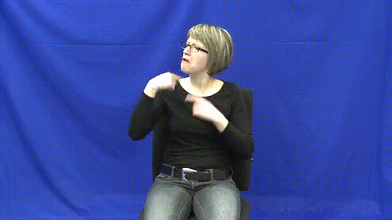
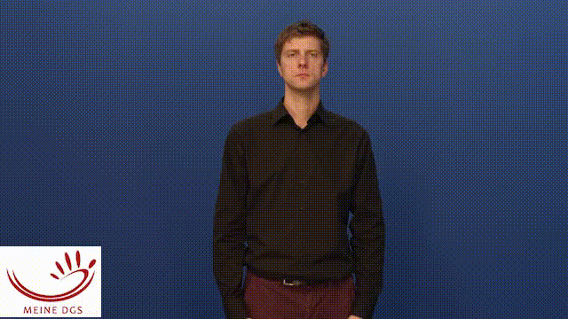
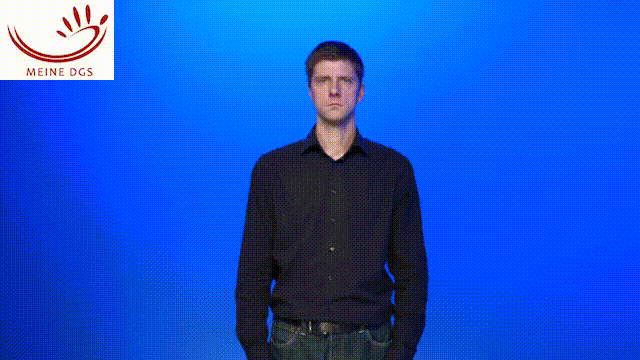
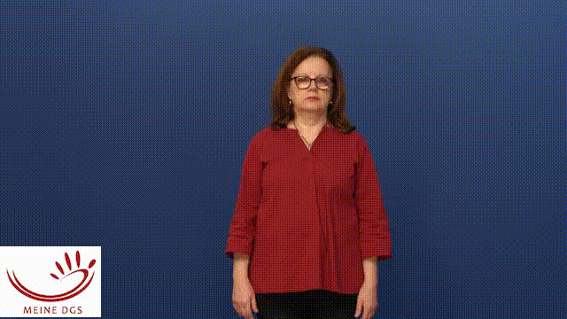
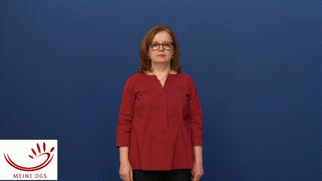
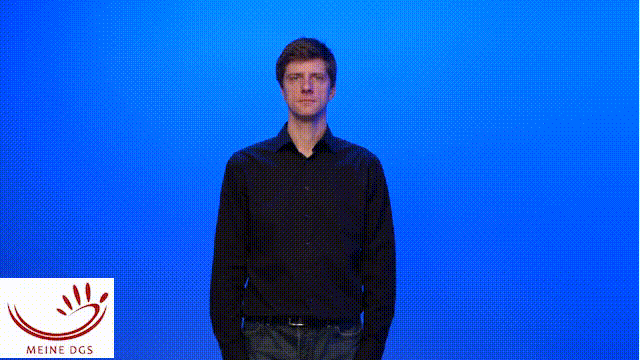

# Fluent (Sign Language) Pose Synthesis

This project aims to make unfluent sign language poses fluent, by post editing the pose sequences.
It deals with correcting the prosody and intonation.

## Usage


### 1. Environment Setup

We recommend using a virtual environment (e.g., `venv` or `conda`) and installing dependencies via `pyproject.toml`.

```bash
# Clone the repository
git clone https://github.com/sign-language-processing/fluent-pose-synthesis.git
cd fluent-pose-synthesis

# Install dependencies using pip (defined in pyproject.toml)
pip install .
```

### 2. Dataset Download and Preparation

We use the DGS Corpus (sentence-level pose data) and DGS Types Dictionary for gloss-level replacement.

```bash
python fluent_pose_synthesis/data/create_data.py \
  --corpus_dir pose_data/tfds_dgs \
  --dictionary_dir pose_data/tfds_dgs \
  --output_dir pose_data/output
```

This will create a structure like:

```
pose_data/
├── tfds_dgs/             # tfds cache
└── output/
    ├── train/
    │   ├── train_1_original.pose
    │   ├── train_1_updated.pose
    │   ├── train_1_metadata.json
    ├── validation/
    └── test/
```


### 3. Debug Model Training

To quickly test if everything works:

```bash
python -m fluent_pose_synthesis.train \
  --name debug \
  --data assets/sample_dataset \
  --save save/debug_run
```

This will:
- Load only 16 training examples
- Use batch size = 16
- Train for 100 epochs
- Save logs and checkpoints under `save/debug_run`


## Explanation

Somehow, a pose sequence was generated form sign language videos.

For example, here is a video of a sign language sentence:

[](https://www.sign-lang.uni-hamburg.de/meinedgs/html/1248862_en.html#t00012332)

Given a system that
given `We were expecting something simple, like a youth hostel.`
Translated to the glosses `DIFFERENT1 IMAGINATION1A LIKE3B* EASY1 YOUNG1* HOME1A`.
Then, using [spoken-to-signed-translation](https://github.com/ZurichNLP/spoken-to-signed-translation),
videos were found for each gloss, and then put together.
Or using [Ham2Pose](https://rotem-shalev.github.io/ham-to-pose/), each HamNoSys was animated to a pose sequence.

| Gloss      | HamNoSys                                                                                   | Video                                                                                                                                                           |
|------------|--------------------------------------------------------------------------------------------|-----------------------------------------------------------------------------------------------------------------------------------------------------------------|
| DIFFERENT1^ |                                                                              | [](https://www.sign-lang.uni-hamburg.de/meinedgs/types/type13673_en.html)              |
| IMAGINATION1A^ |                                                                                | [](https://www.sign-lang.uni-hamburg.de/meinedgs/types/type13839_en.html)        |
| LIKE3B*    |                                                          | [](https://www.sign-lang.uni-hamburg.de/meinedgs/types/type82561_en.html)                      |
| EASY1      |                                                                        | [](https://www.sign-lang.uni-hamburg.de/meinedgs/types/type13082_en.html)                          |
| YOUNG1*    |                                                                        | [](https://www.sign-lang.uni-hamburg.de/meinedgs/types/type13872_en.html)                      |
| HOME1A     |                                                                          | [](https://www.sign-lang.uni-hamburg.de/meinedgs/types/type13958_en.html)                    |


<table>
  <tr>
    <th width="50%">When performed in this way, the pose sequence is not fluent</th>
    <th width="50%">This project aims to make the pose sequence more natural</th>
  </tr>
  <tr>
    <td></td>
    <td></td>
  </tr>
</table>

### Abstract

Generated sign language videos have the potential to revolutionize the way deaf individuals interact with the world, but
they also present a new set of challenges, including the difficulty of post-editing these videos. In this paper, we
present an innovative idea for post-editing generated sign language videos. Our approach consists of three main steps:
recording a corrected video, processing the original and corrected videos using a neural model, and diffusing the new
sequence to create a more fluent video. We use the MeineDGS corpus as our dataset and sign-spotting to detect signs in
existing videos. Our experiments show promising results, and we believe that this approach has the potential to be
successful in post-editing generated sign language videos.

### Introduction

Sign languages are an important means of communication for deaf communities, and recent advances in Sign Language
Translation and Avatar Technology have made it possible to generate sign language videos using avatars or realistic
humans. However, these generated videos are not easily editable and may contain errors that need correction. In this
paper, we present an innovative idea for post-editing generated sign language videos.

Our idea relies on the fact that videos are generated as pose sequences and then animated using either an avatar or a
realistic human via Generative Adversarial Networks (GANs) or diffusion. When a sign is detected to be incorrect or a
phrase needs to be edited, a new video can be recorded of the corrected version. The original video, along with the new
corrected video, is then processed by a neural model that stretches and compresses the new video to match the timing of
the original sequence. Finally, the model uses diffusion to create a more fluent video, without changing the content of
the signing.

To train this system, we propose using sign-spotting to detect signs in existing videos, then use a dictionary form of
these signs to train the system to diffuse from the original video plus the dictionary form to a fluent video. One
dataset that could be used for this purpose is the MeineDGS corpus, which contains all sentences fully glossed and a
dictionary (DGS Types) that includes many signs in their dictionary form.

In this paper, we present the details of our proposed idea and discuss the potential challenges and limitations.
Although we do not yet have results, we believe that this approach has the potential to be successful in post-editing
generated sign language videos.

### Background

Sign languages are an essential part of deaf culture and play a crucial role in communication for deaf individuals. With
the development of Sign Language Translation and Avatar Technology, it is now possible to generate sign language videos
using avatars or realistic humans. These generated videos have the potential to revolutionize the way deaf individuals
interact with the world, but they also present a new set of challenges. One of these challenges is the difficulty of
post-editing generated sign language videos, since they are not easily editable.

The problem of post-editing generated videos is not limited to sign languages, as it is also a challenge for spoken
languages. In the field of spoken language post-editing, there have been several works that address the issue of editing
generated text. One approach is to use machine translation models that are fine-tuned on a specific domain or task to
improve the fluency and accuracy of the generated text. Another approach is to use an encoder-decoder architecture that
can generate new text based on an input sequence, while preserving the content and meaning of the original text.

However, these approaches are not directly applicable to sign language videos, which require a different approach.
Unlike spoken language, sign languages are visual and gestural, and therefore, post-editing generated sign language
videos requires a different set of techniques. In this paper, we present an innovative idea for post-editing generated
sign language videos, which takes into account the unique challenges and requirements of sign languages.

### Method

In this section, we describe our proposed method for post-editing generated sign language videos. Our method consists of
three main steps: recording a corrected video, processing the original and corrected videos using a neural model, and
diffusing the new sequence to create a more fluent video.

1. **Recording a Corrected Video.**
   When a sign is detected to be incorrect or a phrase needs to be edited in a generated sign language video, a new
   video can be recorded of the corrected version. The new video should only include the corrected portion, and the
   signing should be as fluent as possible.
2. **Processing the Original and Corrected Videos.**
   The original video, along with the new corrected video, is then processed by a neural model that stretches and
   compresses the new video to match the timing of the original sequence. The model should be trained to perform this
   task, which can be done by using a large dataset of sign language videos.
3. **Diffusing the New Sequence.**
   Finally, the model uses diffusion to create a more fluent video, without changing the content of the signing. This
   step is crucial, as it ensures that the corrected video is integrated smoothly into the original video, resulting in
   a more natural-looking sign language video.

To train the neural model, we propose using sign-spotting to detect signs in existing videos, then use a dictionary form
of these signs to train the system to diffuse from the original video plus the dictionary form to a fluent video. One
dataset that could be used for this purpose is the MeineDGS corpus, which contains all sentences fully glossed and a
dictionary (DGS Types) that includes many signs in their dictionary form.

### Experiments

In this section, we describe the experimental setup for training our proposed system for post-editing generated sign
language videos.

#### Dataset

We use the MeineDGS corpus as our dataset, which contains all sentences fully glossed and a dictionary (DGS Types) that
includes many signs in their dictionary form. For every sentence in the corpus, we sample 1 to all signs in the sentence
and replace them with a dictionary form. This results in a new sequence that can be used as input for our neural model.

#### Neural Model

Our neural model is a deep learning-based system that takes as input the original video sequence and the corrected
sequence (in dictionary form), and outputs a more fluent video. The model is trained using the MeineDGS corpus and the
sign-spotting data to minimize the difference between the output video and the original video.

#### Evaluation

To evaluate the performance of our proposed system, we use subjective and objective metrics. Subjective metrics include
human judgment of the fluency and naturalness of the output video, while objective metrics include metrics such as sign
recognition accuracy and video quality.
