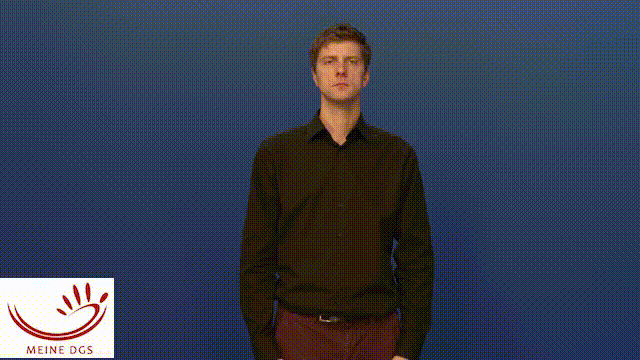
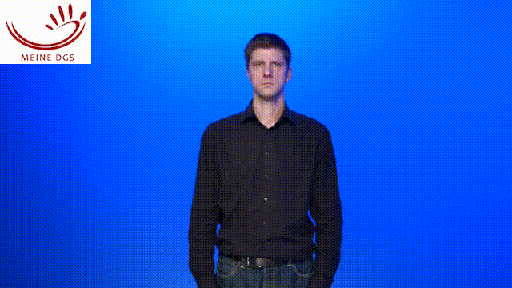
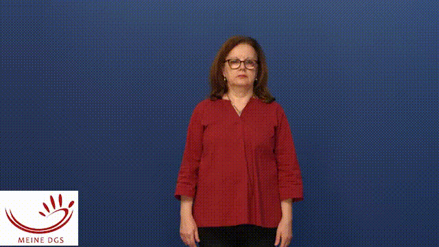
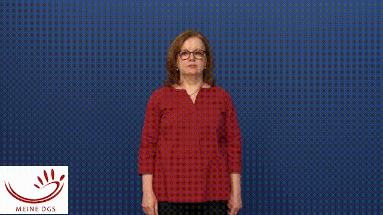
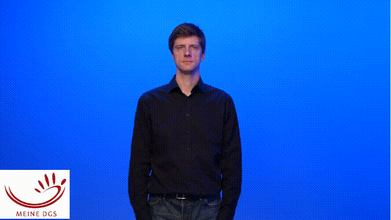
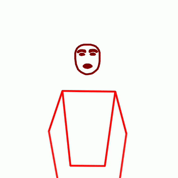
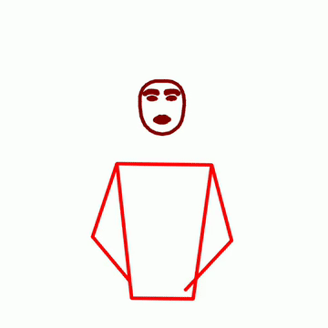
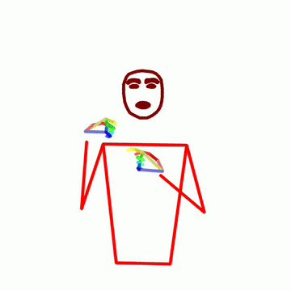

# Fluent (Sign Language) Pose Synthesis

Concatenative **pose stitching** for sign language, and an evaluation of how
close it gets to real, fluent signing.

A spoken-to-signed pipeline turns a sentence into a gloss sequence, looks up an
**isolated dictionary pose** for each gloss, and stitches them together (see
[spoken-to-signed-translation](https://github.com/sign-language-processing/spoken-to-signed-translation)).
The result is understandable but *not fluent*: isolated citation forms are slow,
fully-formed, and full of preparation/hold/retraction frames, whereas fluent
signing is short, reduced, and co-articulated.

This repository (a) measures that gap against the **DGS Corpus** — which gives us,
for every sentence, the exact fluent reference *and* the gloss segmentation — and
(b) improves the stitching to close as much of it as pure concatenation can.

> **History.** This project originally proposed a diffusion model to post-edit
> stitched sequences into fluent ones. That model-based code has been removed on
> the `stitching-improvements` branch in favour of first making the *stitching*
> as good as it can be, and quantifying the residual gap a learned model would
> still need to bridge. See [`docs/FINDINGS.md`](docs/FINDINGS.md).

## The problem, in one example

An English sentence is translated to glosses, each gloss is replaced by its
isolated DGS Types citation form, and the forms are concatenated:

| Gloss | Isolated citation form |
|---|---|
| DIFFERENT1^ | [](https://www.sign-lang.uni-hamburg.de/meinedgs/types/type13673_en.html) |
| IMAGINATION1A^ | [](https://www.sign-lang.uni-hamburg.de/meinedgs/types/type13839_en.html) |
| LIKE3B* | [](https://www.sign-lang.uni-hamburg.de/meinedgs/types/type82561_en.html) |
| EASY1 | [](https://www.sign-lang.uni-hamburg.de/meinedgs/types/type13082_en.html) |
| YOUNG1* | [](https://www.sign-lang.uni-hamburg.de/meinedgs/types/type13872_en.html) |
| HOME1A | [](https://www.sign-lang.uni-hamburg.de/meinedgs/types/type13958_en.html) |

<table>
  <tr>
    <th width="33%">1. Naive stitch (spoken-to-signed)<br/><sub>where we started — 565 frames</sub></th>
    <th width="33%">2. Our stitch (<code>fluent</code> preset)<br/><sub>current approach — 199 frames</sub></th>
    <th width="33%">3. Real signing (target)<br/><sub>the actual reference — 125 frames</sub></th>
  </tr>
  <tr>
    <td></td>
    <td></td>
    <td></td>
  </tr>
</table>

The naive concatenation of isolated citation forms (left) is slow and stilted.
Our `fluent` stitch (middle) trims the citation holds, de-jitters the motion, and
compresses toward natural length — measurably closer to the real signing (right)
in duration, smoothness, hand position, and SignCLIP embedding. The remaining gap
(true coarticulation) is what a learned model would close.

All three are rendered through the same [`stitching/visualize.py`](fluent_pose_synthesis/stitching/visualize.py).
Every source sign is **anonymized to one canonical signer** (pose-anonymization,
applied *per sign* — a single post-stitch pass does not unify signers), so all
tiles show one consistent body. The `fluent` stitch also **removes each sign's
idle hand** (a one-handed sign's resting hand is dropped and interpolated from
its neighbours) instead of freezing a hand off to the side — compare the naive
tile, where resting hands snap in and out.

## What we found

Measured over random DGS Corpus samples (details and per-config tables in
[`docs/FINDINGS.md`](docs/FINDINGS.md)):

- **Isolated citation forms are ~12–15× longer than the same sign in fluent
  context** (median 116 vs. 10 frames), yet move at nearly the same per-frame
  speed. The gap is duration/holds, not velocity.
- The **spoken-to-signed baseline output is ~2.6× too long**, even after its
  hand-raise trimming — this over-length is its dominant unnaturalness.
- **pose-evaluation's DTWp is length-biased** (cumulative path distance → lower
  for shorter clips), so we also report a path-length-normalized `dtwp_norm`
  (shape) and `len_ratio` (timing) separately.
- Improving the stitch is a **Pareto trade-off between timing and shape**:

  | config | shape (`dtwp_norm`, ↓) | length ratio (→1.0) |
  |---|---|---|
  | baseline (spoken-to-signed) | **0.54** | 2.60 |
  | + segmentation trim, no padding (`seg_pad00`) | 0.79 | 1.54 |
  | + per-sign duration cap 25 (`cap_25`) | 0.97 | 1.08 |
  | + resample to 20 frames/sign (`fps_20`) | 0.99 | 1.03 |

  **Segmentation-model trimming** ([sign/segmentation](https://github.com/sign/segmentation))
  removes citation-form holds far better than the hand-raise heuristic and gives
  the best "natural but faithful" point. Reaching true fluent length needs
  compression that distorts shape — **that residual gap is what a learned model
  is for.** (Results reproduce on a held-out sample.)

A second study (100+ configurations, [`docs/FINDINGS.md`](docs/FINDINGS.md) Part 2)
diagnosed *where* the DTWp error lives and tried to move it directly, drawing on
[Sign Stitching (Walsh et al., BMVC 2024)](https://arxiv.org/abs/2405.07663):

- **~half of raw DTWp is a metric artifact** — undetected reference keypoints are
  filled with 10.0, spiking the distance; hand *position* (not handshape)
  dominates the rest, and depth (z) is uninformative.
- **DTWp shape has a hard floor** at the segmentation-trim config: no stitching
  geometry (velocity-matched transitions, co-articulation / hand-detach,
  resampling, position alignment) beat it by more than ~0.4 %. The
  citation-vs-fluent gap is not closable by concatenation — it needs the model.
- **Butterworth low-pass filtering** removes seam jitter at **zero** DTWp cost.

A third study ([`docs/FINDINGS.md`](docs/FINDINGS.md) Part 3) dropped DTWp as the
target and optimized **distribution closeness** and a **SignCLIP embedding
distance** instead — and got a real, held-out-validated improvement. The
**recommended `fluent` preset** (anonymize to one signer + segmentation trim +
6 Hz low-pass + duration cap) beats the spoken-to-signed baseline on:

| metric (held-out seed 1) | baseline | `fluent` |
|---|---|---|
| SignCLIP embedding distance ↓ (semantic closeness) | 0.283 | **0.273** |
| jerk / jitter ↓ | 0.0079 | **0.0041** |
| hand y-position distance ↓ | 0.326 | **0.308** |
| length ratio (→1.0) | 2.51 | **0.99** |

- **Segmentation trimming** makes the stitch *semantically* closer (SignCLIP),
  not just shorter.
- **Butterworth (~6 Hz)** cuts jitter ~4–5× with no embedding cost.
- **Co-articulation / hand-detach hurts** — pulling signs together moves them out
  of their meaningful signing-space locations (embedding distance rises).
- The remaining gap is the citation-vs-fluent coarticulation problem — the model's job.

## Install

```bash
git clone https://github.com/sign-language-processing/fluent-pose-synthesis.git
cd fluent-pose-synthesis

pip install -e .                       # core stitching (pose-format, numpy, scipy)
pip install -e ".[data,eval]"          # + DGS loaders and DTWp/length metrics
pip install -e ".[data,eval,segmentation]"   # + segmentation-based trimming
```

## Usage

### Stitch a gloss sequence

Isolated DGS-Types forms are downloaded and pose-extracted (MediaPipe holistic)
on first use and cached.

```bash
fluent-stitch stitch --glosses HAUS1A WISSEN2B FUSSBALL2 --out stitched.pose  # uses the `fluent` preset
# or pass your own .pose files instead of gloss names
fluent-stitch stitch --glosses a.pose b.pose c.pose --out stitched.pose --config seg_pad00
```

```python
from pose_format import Pose
from fluent_pose_synthesis import concatenate_poses, StitchConfig

poses = [Pose.read(open(p, "rb").read()) for p in ("a.pose", "b.pose", "c.pose")]
stitched = concatenate_poses(poses, StitchConfig(trim_method="segmentation", padding=0.0))
```

`StitchConfig` (defaults reproduce the spoken-to-signed baseline exactly):

| field | default | effect |
|---|---|---|
| `reduce_holistic`, `normalize` | `True` | pre-processing |
| `anonymize` | `False` | map every sign to one canonical signer (pose-anonymization) *per source sign*, before stitching |
| `drop_inactive_hands` | `False` | remove a *resting* hand — one that is **both still and low** (or undetected); movement keeps chest-level two-handed signs, height keeps still-but-raised handshapes (e.g. the number "5"). Never drops both hands |
| `hand_transition` | `"linear"` | how a briefly-removed hand returns: `"ease_in"` holds near the previous pose then makes a preparation stroke into the next sign. A hand idle longer than `hand_max_gap` stays absent (not held up across the sentence) |
| `rest_envelope` | `False` | raise the hands from a rest pose before the first sign and lower them after the last (natural rest→sign→rest; costs distribution metrics by design) |
| `trim`, `trim_method` | `True`, `"hand_raise"` | per-sign lead-in/out trim; `"segmentation"` uses the model, falls back to `hand_raise` |
| `padding` | `0.20` | seconds of interpolated transition between signs |
| `speed` | `1.0` | uniform tempo compression (>1 = shorter) |
| `frames_per_sign` | `None` | resample every sign to a fixed length |
| `max_sign_frames` | `None` | compress **only** signs longer than this |
| `transition` | `"pad"` | inter-sign bridge: `"pad"` \| `"velocity"` \| `"direct"` |
| `butter`, `butter_cutoff` | `False`, `6.0` | Butterworth low-pass (Hz) — de-jitter |
| `coarticulate` | `0.0` | pull signs together to cut inter-sign travel (0–1) |
| `hand_shift` | `None` | `(dx,dy,dz)` distribution-alignment shift of hands |
| `connection_search`, `savgol` | `True` | closest-frame join, temporal smoothing |

Named presets live in `experiments.CONFIGS`; `fluent` (anonymize + segmentation
trim + 6 Hz low-pass + duration cap) is the recommended default, `fluent_long`
keeps the citation length.

### Evaluate against the DGS Corpus

Requires the DGS data mounts (see [`config.py`](fluent_pose_synthesis/stitching/config.py);
override with `SIGN_RAW_DATA`, `SIGN_TRANSFORMED_VIDEOS`).

```bash
fluent-stitch analyze  --n 40                 # corpus vs. isolated-form statistics
fluent-stitch evaluate --n 40 --config all    # A/B every config vs. baseline
```

Metrics: DTWp (pose-evaluation), mask-aware kinematic **distribution** distances
(velocity/acceleration/jerk/position Wasserstein, hold-fraction), and — when the
SignCLIP service is running — a **semantic embedding distance**:

```bash
# build once (native arm64; downloads the checkpoint + exports ONNX)
git clone https://github.com/sign/sign-language-assessment.git
docker build -t sign-clip sign-language-assessment/sign_clip
docker run -d -p 8080:8080 -e PORT=8080 sign-clip     # POST /api/embed/pose -> 768-dim
```

The iteration driver (`iterate.py`) then reports per-sentence embedding cosine
distance and a Fréchet Pose Distance alongside the kinematic metrics. Stitch with
`reduce_holistic=False` so the pose stays full-holistic (embeddable); hand-based
metrics are unaffected.

## Architecture

```
fluent_pose_synthesis/stitching/
├── config.py        # data-mount paths (env-overridable) + constants
├── pose_lookup.py   # md5(video)→/mnt pose; MediaPipe holistic extraction + cache
├── dgs_corpus.py    # EAF (pympi) → sentences/glosses; slice fluent reference poses
├── dgs_types.py     # gloss → isolated citation pose (download + extract + cache)
├── trim.py          # per-sign trimming: hand-raise heuristic | segmentation model
├── concatenate.py   # config-driven stitching (baseline-faithful + toggles)
├── metrics.py       # DTWp/matched/clean + mask-aware velocity/accel/jerk/position distributions
├── signclip.py      # SignCLIP embedding client + cosine / Fréchet Pose Distance
├── visualize.py     # render poses to GIF (anonymized, consistent framing)
├── harness.py       # sample sentences → reconstruct → score
├── experiments.py   # named configs (incl. `fluent`), A/B sweep, TSV/JSON logging
├── analysis.py      # corpus vs. reconstruction characteristics
├── diagnostics.py   # where the DTWp error comes from (masking, position, ...)
├── iterate.py       # hypothesis-driven iteration driver (results.tsv, +embeddings)
├── analyze_results.py  # multi-objective ranking of an iteration run
├── warm_cache.py    # parallel pre-extraction of an eval set's poses
└── cli.py           # `fluent-stitch` entry point
```

Evaluation uses [pose-evaluation](https://github.com/sign-language-processing/pose-evaluation)
(DTWp) and, optionally, [sign/segmentation](https://github.com/sign/segmentation)
and [pose-anonymization](https://github.com/sign-language-processing/pose-anonymization).

## Citation

```bib
@misc{moryossef2023fluent,
    title={Fluent Sign Language Pose Synthesis},
    author={Amit Moryossef},
    howpublished={\url{https://github.com/sign-language-processing/fluent-pose-synthesis}},
    year={2023}
}
```
